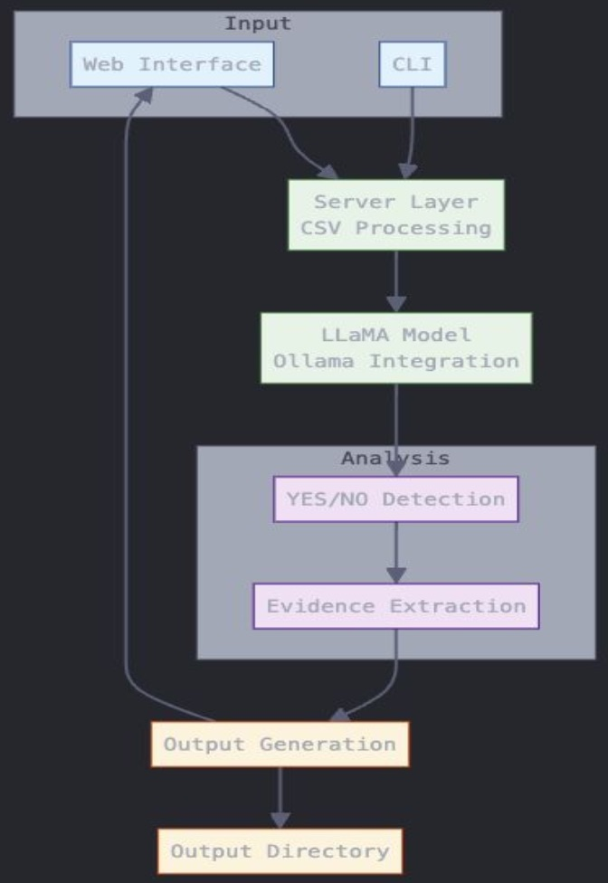
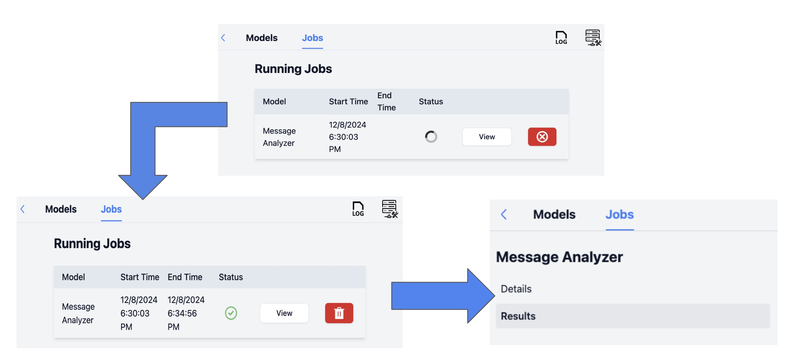
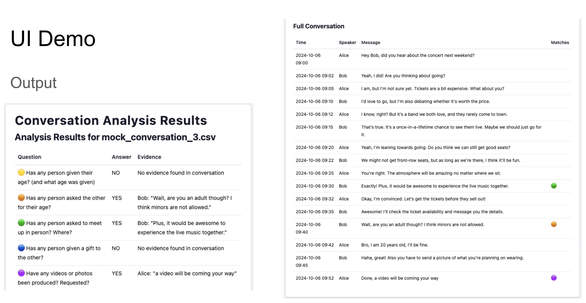

# Message Analyzer for Child Safety
* A tool for analyzing conversations using large language models.
* A machine learning tool that analyzes chat conversations to detect potentially concerning patterns related to child safety. 
* The system uses LLaMA models to process conversations and identify markers like age discussions, meetup requests, gift exchanges, and media sharing.


## Implementation details - Architecture


### 1. Interface Layer
* The Interface Layer contains RescueBox for web display and a Command Line Interface for batch processing.
* RescueBox provides custom UI components for analysis display and handles file upload processing.
* The Command Line Interface focuses on batch processing capabilities and output file generation.

### 2. Core Processing
* The Server Layer manages request handling, CSV parsing, and results formatting.

### 3. ML Integration
* Ollama Integration takes care of LLaMA model setup, API communication, and response handling.
* The process uses a two-stage system for initial detection and evidence extraction.
  * Stage 1: YES/NO detection
    * basic classification
    * question list:
      1. Has any person given their age? (and what age was given)
      2. Has any person asked the other for their age?
      3. Has any person asked to meet up in person? Where?
      4. Has any person given a gift to the other? Or bought something from a list like an amazon wish list?
      5. Have any videos or photos been produced? Requested?
  * Stage 2: Evidence extraction
    * Evidence processing includes pattern matching, context extraction, and multi-evidence handling.

### 4. Output Generation
* Output Generation supports both markdown reports for frontend and CSV format for CLI use.

## Prerequisites
* Project requires Python version 3.11 or higher. 

### Ollama Setup
* Download and install Ollama from GitHub
  * https://github.com/ollama/ollama
* Pull the LLaMA 3.1 model: `ollama pull llama3.1`

## Installation
* Installing requirements
```
python3 -m pip install -r requirements.txt
```

## Usage: Web Interface
### Starting the server
```
python3 -m src.backend.server
```

### UI
* Input: CSV file format

* process: 

* Output: 


### Test Api
```
python3 src/client/client.py
```

## Usage: CLI
```
python3 -m src.client.cmd_client --input_file ./src/data_processing/cornell_movie_dialogs/split_conversations/conversations_part_000.json --output_file ./analysis_results.csv --model=llama3.1 
```
* CLI Parameters
  * `--input_file`: Path to the input JSON file containing conversations
  * `--output_file`: Path where the analysis results will be saved (CSV format)
  * `--model`: Name of the LLM model to use (default: llama3.1)

## Evaluation
* documentation location: doc/evaluation_readme.md

## Evaluation Time
* Command line interface tool 
5 samples take 2 minutes and 4 seconds in MacBook Air (8G memory)
Each sample takes 25 seconds
* Frontend
5 samples take 15 minutes, so each job takes around 3 minutes to complete on MacBook Air (8G memory)
Conversation size ranges from 8 lines to 20 lines.  


## Project Structure
```
message-analyzer/
├── src/
│   ├── backend/        # Flask server implementation
│   ├── client/         # API and CLI clients
│   └── data_processing/# Data processing utilities
├── evaluation/
│   ├── api_doc.md              # Flask-ML related doc
│   ├── evaluation_readme.md    # Evaluation doc
│   └── evaluation_result.md    # Evaluation result
├── requirements.txt    # Python dependencies
└── README.md          # This file
```

## Future Improvements
* Enhanced data validation with combined AI and human checking
* Long conversation handling optimization
* Improved model accuracy through few-shot prompting
